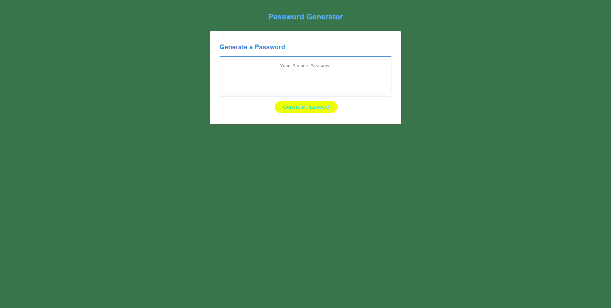

# Password Generator
This is a simple password generator web application that allows users to generate secure passwords based on their desired criteria. It provides a user-friendly interface for selecting the password length and character types to include.

## Usage

Open the "index.html" file in a web browser.

You will see the "Password Generator" header and a "Generate Password" button.

Click the "Generate Password" button to start generating a password.

A series of prompts will appear asking for password criteria. The prompts will include the following:

Length: Enter the desired length of the password (between 8 and 128 characters).

Character Types: Confirm whether you want to include lowercase, uppercase, numeric, and/or special characters in the password.

After answering all the prompts, the generated password will be displayed in the text area below the button.

You can copy the generated password from the text area and use it as needed.

If you want to generate another password, simply click the "Generate Password" button again and repeat the process.

## File Structure
The project consists of the following files:

index.html: The HTML file that defines the structure and content of the web page.

script.js: The JavaScript file that contains the logic for generating passwords based on user criteria.

style.css: The CSS file that defines the styles and layout of the web page.

## Styling
The style.css file contains CSS rules for styling the elements of the web page. It includes rules for the header, card layout, buttons, and text area.

The styles are designed to provide a visually appealing and responsive user interface, with a clean and modern look.

## Acknowledgements
The password generator code is based on a JavaScript implementation that handles user prompts, validates inputs, and generates random passwords based on the selected criteria.

The project utilizes HTML, CSS, and JavaScript to create an interactive and functional password generator.

## Limitations
Please note the following limitations of the password generator:

The generated passwords are random and may not conform to specific password strength requirements of certain systems or services.

The password generator operates locally within the web browser and does not store or transmit any user input or generated passwords.

It is always recommended to follow best practices for password security, such as using unique passwords for each account and regularly updating them.

The password generator does not guarantee the uniqueness or uniqueness of generated passwords.

## License
This project is licensed under the MIT License. Feel free to modify and use the code according to your needs.
